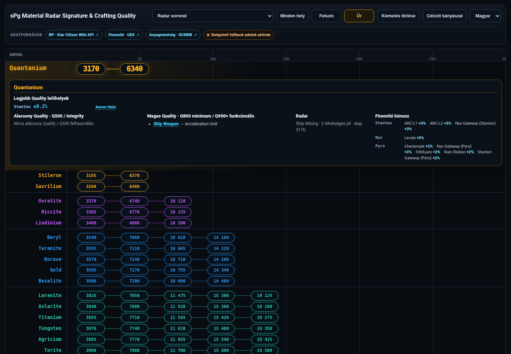
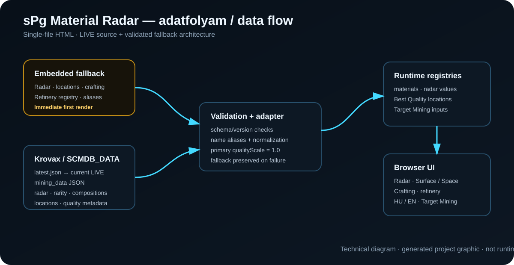

# sPg Material Radar Signature & Crafting Quality

[Magyar főoldal](README.md) · **English**

A single-file Star Citizen mining and crafting helper.

**Live page:** https://duczapeter.github.io/sPg-Material-Radar-Signature-Crafting-Quality/  
**Main artifact:** [`index.html`](index.html)  
**Release artifact:** [`release/sPg_Material_Radar_Signature_Crafting_Quality.html`](release/sPg_Material_Radar_Signature_Crafting_Quality.html)

## Purpose

The page combines radar signatures, best-known Quality locations, crafting use, refinery bonuses and multi-material Target Mining in one browser application.

### Main features

- Ship, ROC and FPS mineable radar signatures;
- `All locations / Surface / Space` filtering;
- Best Quality locations for Stanton, Pyro and Nyx;
- separate Q500 / Integrity and Q800–Q900+ crafting use;
- component-family and verified component matches;
- positive refinery bonuses;
- common-location search for multiple selected materials in Target Mining;
- KrovaxCode/SCMDB_DATA LIVE mining loading with embedded fallback;
- Hungarian and English UI.

## Quick use

1. Open `index.html` or the live GitHub Pages site.
2. Keep `Radar order` selected when searching by signature.
3. Choose `All locations`, `Surface` or `Space`.
4. Click a material for Quality, crafting, radar and refinery details.
5. Open `Target Mining` to select multiple materials and search common locations.
6. Use the language selector to switch UI language.

Detailed guide: [`docs/USER_GUIDE.en.md`](docs/USER_GUIDE.en.md)

## How it works

The production HTML renders from embedded fallback data immediately, then attempts to load the Krovax `latest.json` manifest and the current LIVE mining file. LIVE data can replace relevant runtime registries only after validation. If the external source is unavailable or invalid, fallback data remains active.

Verified project formula for Best Quality display:

`depositShare × primary maxPercent`

where the primary composition part has `qualityScale = 1.0`. `groupProbability` is not a multiplier for the displayed material percentage.

## Data sources

- **KrovaxCode / SCMDB_DATA:** LIVE mining manifest and mining data;
- **SCMDB:** mining/Quality reference;
- **Star Citizen Wiki API:** blueprint/component verification;
- **StarCitizenWiki/scunpacked-data:** pinned ship-weapon blueprint source;
- **UEX:** reference for the currently embedded refinery-bonus registry;
- **CStone:** external Aaron Halo route-helper link.

Detailed precedence, freshness, fallback and licence/terms status: [`docs/DATA_SOURCES.en.md`](docs/DATA_SOURCES.en.md) and [`THIRD_PARTY_NOTICES.md`](THIRD_PARTY_NOTICES.md).

## Automatic updates and cache

The current production build checks the Krovax LIVE manifest **on page load** and fetches the current mining file with `cache: no-store`. The previously planned four-hour repeat refresh, last-known-good cache, full schema-drift diagnostics, automatic discovery of all new materials and LIVE refinery refresh are **not yet production features**.

## Requirements

- a modern browser with JavaScript, Fetch API and CSS support;
- internet access for LIVE source refresh;
- no installation or build step.

## Privacy

There is no project-owned backend, account/login system or built-in analytics. The selected UI language is stored in `localStorage`. Runtime source refresh connects directly from the browser to third-party services. Details: [`PRIVACY.md`](PRIVACY.md).

## Validation state

| Area | State |
|---|---|
| Canonical GitHub baseline | **SOURCE VERIFIED** |
| Static release gate | **STATIC VERIFIED · PASS** |
| Offline/fallback browser smoke | **RUNTIME VERIFIED · PASS** |
| Desktop/mobile real UI screenshots | **RUNTIME VERIFIED · PASS** — real browser screenshots under the documented fallback condition |
| LIVE third-party browser E2E | **NOT VERIFIED** in this packaging run |
| GitHub Pages pixel parity | **NOT VERIFIED** in this packaging run |

The package status (PACKAGE STATUS) is therefore **READY WITH LIMITATIONS**. The published repository is validated by a post-publish fresh-clone check (see `STATUS.md`). See [`STATUS.md`](STATUS.md), [`docs/TESTING.md`](docs/TESTING.md) and [`docs/RELEASE_CONTRACT.md`](docs/RELEASE_CONTRACT.md).

## Known limitations

Most importantly: Surface/Space classification is still partly name/pattern based; the place filter and Target Mining are not fully coupled; there is no four-hour refresh or last-known-good cache; refinery bonuses are not a LIVE UEX feed. Full list: [`docs/KNOWN_LIMITATIONS.en.md`](docs/KNOWN_LIMITATIONS.en.md).

## Licence and third-party rights

The repository's existing licence state for original project code is preserved: **All Rights Reserved / no open-source reuse permission**. This does not grant rights to Star Citizen/CIG/RSI or any third-party data source.

- [`LICENSE`](LICENSE)
- [`NOTICE.md`](NOTICE.md)
- [`THIRD_PARTY_NOTICES.md`](THIRD_PARTY_NOTICES.md)

This is an **unofficial Star Citizen fan site/tool** and is not affiliated with the Cloud Imperium group of companies. Official site: https://robertsspaceindustries.com/

## Development and continuation

- [`AGENTS.md`](AGENTS.md) — baseline, invariants and testing policy;
- [`STATUS.md`](STATUS.md) — current concise state;
- [`docs/ARCHITECTURE.md`](docs/ARCHITECTURE.md) — architecture;
- [`docs/RELEASE_STANDARD.md`](docs/RELEASE_STANDARD.md) — project-local V4.2 release standard;
- [`docs/RELEASE_CONTRACT.md`](docs/RELEASE_CONTRACT.md) — gates fixed for this release;
- [`CONTRIBUTING.md`](CONTRIBUTING.md) — change and PR rules;
- [`CHANGELOG.md`](CHANGELOG.md) — change history.
