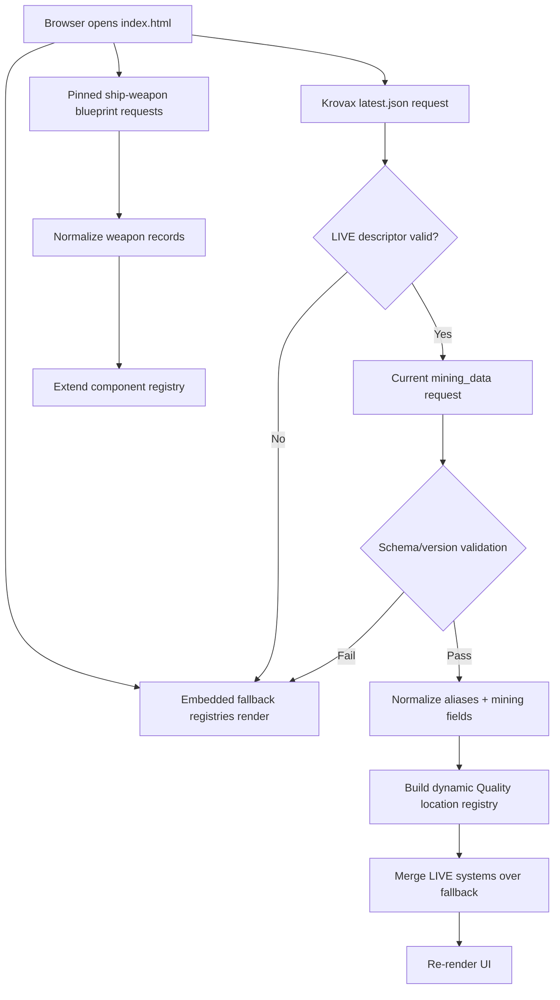
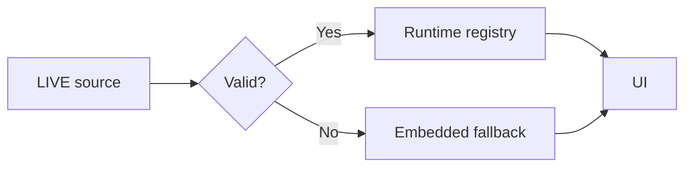

# Architecture

## Overview

The production application is intentionally a **single HTML file** containing structure, CSS, JavaScript, embedded registries and fallback data. GitHub Pages can serve `index.html` directly; no compilation step is required.

## Main in-file subsystems

### Embedded material model

`MATERIALS` contains project-facing material metadata, radar ordering, mining type and crafting usage categories. The current build does not yet create every new source material dynamically.

### Component registry

`COMPONENT_REGISTRY` holds verified component records with family, size/class/grade/manufacturer, recipe slot mappings, source version and verification markers.

Ship-weapon records are additionally loaded at runtime from a pinned `StarCitizenWiki/scunpacked-data` commit.

### SCMDB/Krovax LIVE adapter

The adapter:

1. requests `data/latest.json`;
2. reads `channels.live`;
3. requests the current LIVE `mining_data` file;
4. validates version/schema expectations;
5. normalizes known aliases;
6. updates radar/rarity/Quality metadata;
7. builds dynamic Best Quality locations;
8. merges valid LIVE system data over the curated fallback registry.

### Quality location builder

The verified formula uses deposit share inside the mineable group and the primary composition max percentage:

`depositShare × primary maxPercent`

Primary means `qualityScale = 1.0`. `groupProbability` is presence/context, not a display multiplier.

### Place classifier

Current production classification is a presentation-layer name/pattern classifier, not a full source-metadata classifier.

Space patterns include Lagrange, ring, belt, asteroid, deep space, Aaron Halo and Breaker Stations. Known planets/moons/caves map to Surface. Unknown names currently fall through to Surface: this is a documented ATTENTION item.

### Target Mining

Target Mining uses the active Quality location registry and selected materials, groups matching locations by normalized name and ranks by coverage then average source chance.

### Refinery

Refinery bonus data are embedded. The display keeps only positive best-per-system bonuses and preserves ties.

### Localization

A small in-file HU/EN dictionary drives UI labels. Star Citizen proper names remain unchanged. The selected language is stored in localStorage.

## Storage

Current first-party browser storage:

- localStorage: language preference only.

Planned last-known-good source cache is not implemented in this baseline.

## Failure model

Unknown source semantics should not be guessed. Future adapters should expose UNKNOWN/ATTENTION rather than silently inventing classifications.
